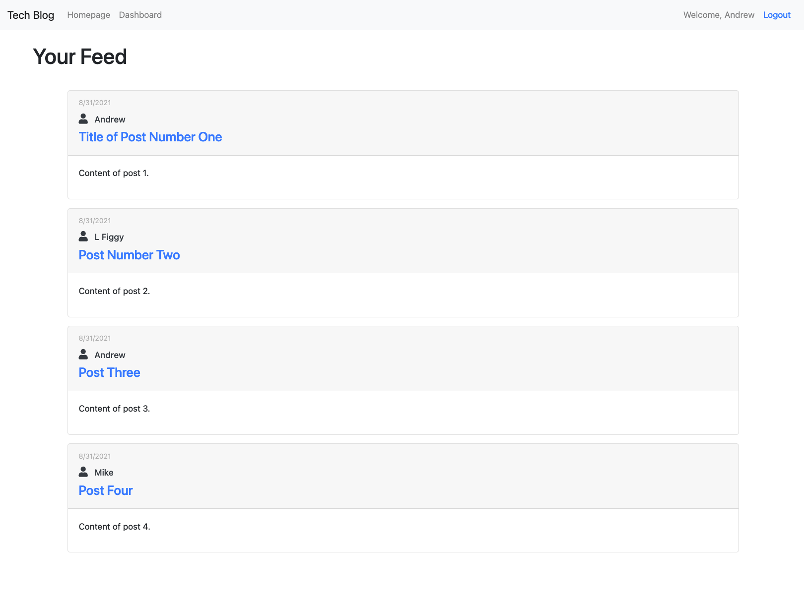
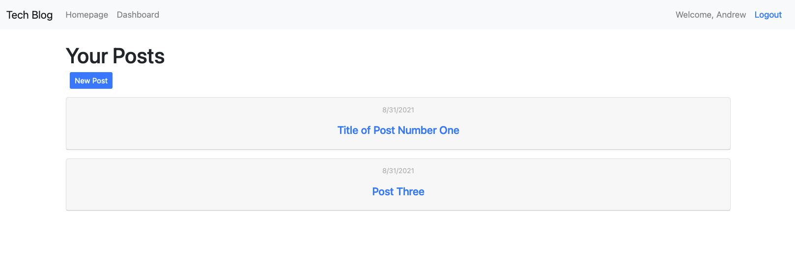
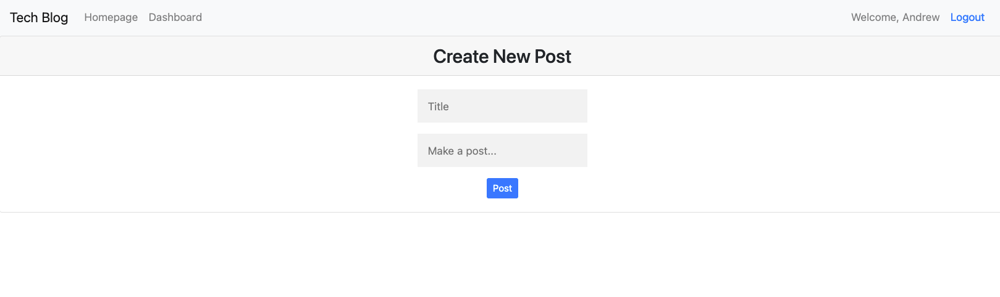
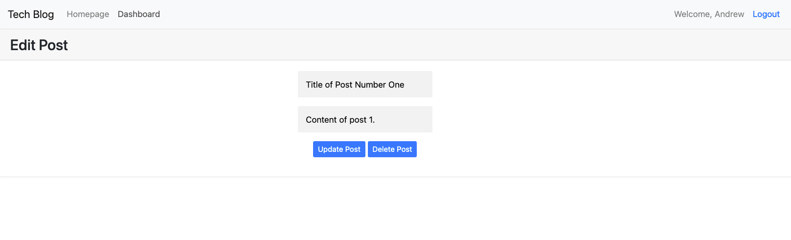

# Tech Blog

## Description

This is a CMS-Style blog where users can make posts, comment on posts, delete their posts and update their posts. Comments are also displayed on each post.

## Links

* [My GitHub](https://github.com/webdev410)
* [Repo](https://github.com/webdev410/blog)
* [Deployed](https://secure-spire-42375.herokuapp.com)

For questions, please email webdev410@gmail.com

## Technologies

* [Node.JS](https://nodejs.org/en/docs/)
* [express](https://www.npmjs.com/package/express)
* [mySQL2](https://www.npmjs.com/package/mysql2)
* [bcrypt](https://www.npmjs.com/package/bcrypt)
* [sequalize](https://sequelize.org/)
* [connect-session-sequalize](https://www.npmjs.com/package/connect-session-sequelize)
* [express-session](https://www.npmjs.com/package/express-session)
* [express-handlebars](https://www.npmjs.com/package/express-handlebars)

## Screenshots

### Homepage

### Dashboard

### New Post

### Edit Post

